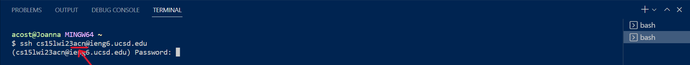

# Week 1 Lab Report

> In this week's lab we learned about setting up remote access.
> This is a tutorial on how to log into a course-specific account on ieng6.

## Installing VScode
>  - On the personal laptop that you plan to use open up the following website: [code.visualstudio.com](https://code.visualstudio.com/)
>  - The website has several download options, so you should choose the right one that matches your device. 
>  
>  - You should open your download and follow the instructions to finish installing VScode on your device. When the installation process is done, VScode should look similar to the picture below when opened:
>  

## Remotely Connecting
> Windows 
> - If you are on Windows (like me), then a very important step is to install git for Windows on your device. Use the following link for download: [gitforwindows.org](https://gitforwindows.org/) 
> - The next step for Window users is to follow the steps in this new [link](https://stackoverflow.com/questions/42606837/how-do-i-use-bash-on-windows-from-the-visual-studio-code-integrated-terminal/50527994#50527994) in order to open the Git Bash terminal in VScode. After that you can continue with the rest of the instructions. 

> - Open a new terminal by using the menu option or Ctrl + ` . It should look like this: 
> 
> - Type in the following command but the letters between the 23 and the @ should be the ones that correspond to your own course-specific account.
> 
> - When it is your first time connecting to a server it will give you basic messages that you can just type `yes` in order to continue.
> - It should then ask for your password. (When it asked for my password it wouldn't let me see what I was typing, but I just typed in my password and pressed enter at the end and it worked fine). Should look like this when you have connected successfully.
> 
> 
## Trying Some Commands
>
