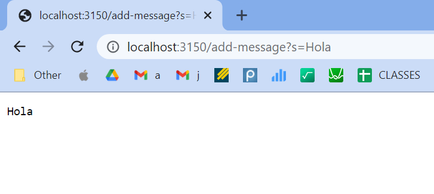
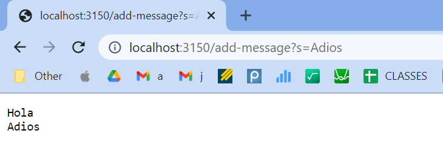
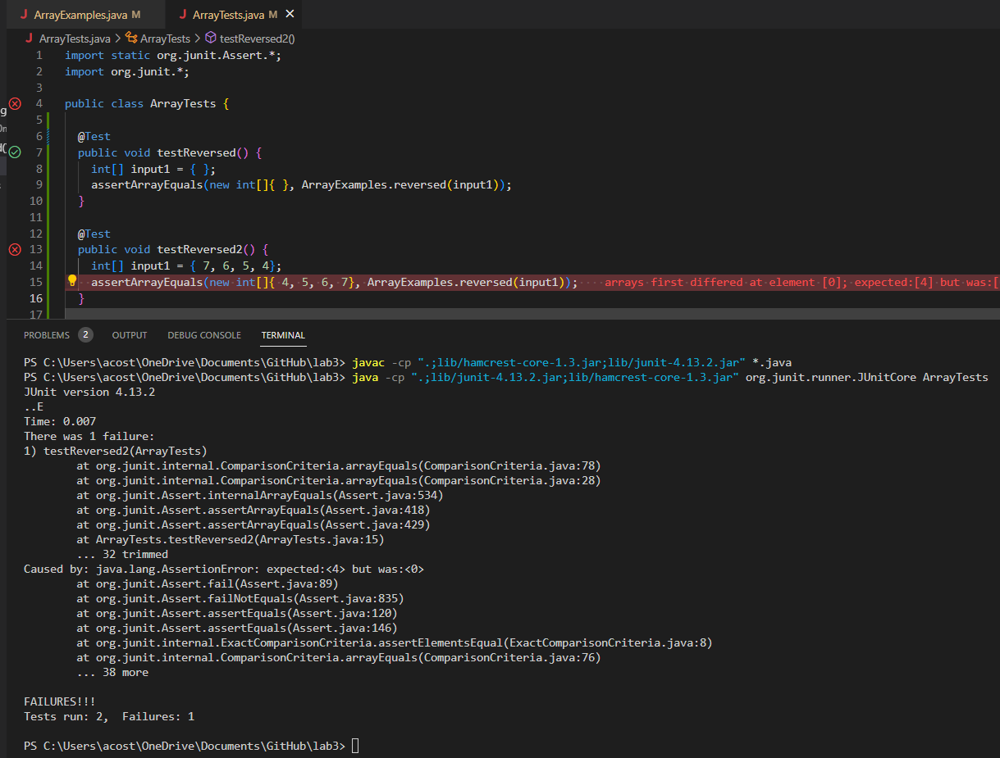
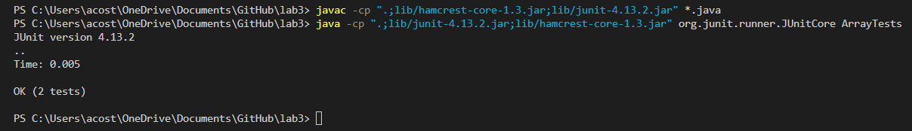

# Lab Report 2
> Servers and Bugs

## Part 1: String Server
> The following is the code for my StringServer, which keeps track of a single string that gets added to by incoming requests.
```
import java.io.IOException;
import java.net.URI;

class Handler implements URLHandler {
    String str = "";

    public String handleRequest(URI url) {
        if (url.getPath().equals("/")) {
            return String.format(str);
        } else {
            System.out.println("Path: " + url.getPath());
            if (url.getPath().contains("/add-message")) {
                String[] parameters = url.getQuery().split("=");
                if (parameters[0].equals("s")) {
                    str += parameters[1] +"\n";
                    return String.format(str);
                }
            }
            return "404 Not Found!";
        }
    }
}

class StringServer {
    public static void main(String[] args) throws IOException {
        if(args.length == 0){
            System.out.println("Missing port number! Try any number between 1024 to 49151");
            return;
        }

        int port = Integer.parseInt(args[0]);

        Server.start(port, new Handler());
    }
}
```
> The following screenshots are of me using /add-message:

> 
> - The methods in my code that are called in this first screenshot are StringServer's main method and Handler's handleRequest. 
> - In the main method the relevant argument is the port number which in this case is 3150. In handleRequest the relevant arguments are the URI url which is first
> analyzed for its path and because it contained "/add-message" the method moves on to check the contents of the query which is after "=". The method takes those
> contents and adds it to the variable str with a "\n" at the end so it moves on to a new line. This method ends with the str variable being returned with its new
> added information "Hola\n". 
> - From this specific request the String variable str went from "" to "Hola\n" because of the url's query being "?s=Hola".


>  
> - Similar to the previous example the methods in my code that are called in this second screenshot are StringServer's main method and Handler's handleRequest. 
> - In the main method the relevant argument is the port number which remains as 3150. In handleRequest the relevant arguments are the URI url. The contents of
> the url's query which is added to the variable str which continues to store the data from the first call. This method ends with the str variable being returned with its new added information "Adios\n". 
> - From this specific request the String variable str went from "Hola\n" to "Hola\nAdios\n" because of the url's query being "?s=Adios". A way in which no values would be changes is if the url is just "http://localhost:3150/" which would still return the str, but the String str itself would not have changed.
---
## Part 2: Bugs
> Lab 3 - Bugs in ArrayExamples.java's reversed method.

> Failure-inducing input for the buggy program:
```
  @Test
  public void testReversed2() {
    int[] input1 = { 7, 6, 5, 4};
    assertArrayEquals(new int[]{ 4, 5, 6, 7}, ArrayExamples.reversed(input1));
  }
 ```
> An input that doesn’t induce a failure:
```
  @Test
  public void testReversed() {
    int[] input1 = { };
    assertArrayEquals(new int[]{ }, ArrayExamples.reversed(input1));
  }
```
> The symptom: (shown by the terminal)
> 

> The Bug Before:
```
  static int[] reversed(int[] arr) {
    int[] newArray = new int[arr.length];
    for(int i = 0; i < arr.length; i += 1) {
      arr[i] = newArray[arr.length - i - 1];
    }
    return arr; 
  }
```
> The Code After Fix:
```
  static int[] reversed(int[] arr) {
    int[] newArray = new int[arr.length];
    for(int i = 0; i < arr.length; i += 1) {
      newArray[i] = arr[arr.length - i - 1];
    }
    return newArray; 
  } 
```
> No More Failures!!!
> 

> The fix addresses the issue because the buggy method was assigning values from the new array to the input array and would return the input array that just held 0s. The Output was {0, 0, 0, 0} for the failure inducing test, while the input that didn't induce a failure was fine because the array was empty. Had to switch the arrays position inside the for loop so that the new array would be assigned the proper values from the original array and at the end return the newArray and not the original array.
---
## Part 3: New Learnings
> One of the things that I found very useful to learn in Lab 3
> In a couple of sentences, describe something you learned from lab in week 2 or 3 that you didn’t know before.
