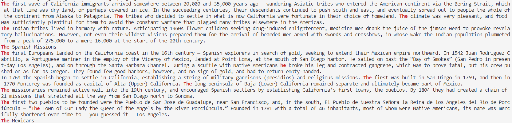
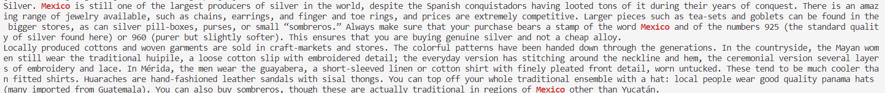

# Lab Report 3
> Researching Commands

## The command I chose to research is `grep`
> The current working directory in which I will run the grep commands that I found is:
>
>   `/home/linux/ieng6/cs15lwi23/cs15wi23acn/skill-demo1-data/written_2/travel_guides/berlitz2/`
---
## 1.) `grep "[^(character)](string)" (filename)`
> Ex. 1 - Input:
```
grep "[^t]he " California-History.txt
```
> Output: 

> Explanation: This command is looking for anywhere in the file that has the string "he ", but any characters before that string can't be "t". It can be a "T", which shows an example of how this command can be useful because if you are looking for when a sentence begins with the word "The" then your options to look through are significantly narrowed down.
> 
> Source: [https://www.digitalocean.com/community/tutorials/using-grep-regular-expressions-to-search-for-text-patterns-in-linux](https://www.digitalocean.com/community/tutorials/using-grep-regular-expressions-to-search-for-text-patterns-in-linux)

> Ex. 2 - Input:
```
grep "[^m]exico " Cancun-WhatToDo.txt
```
> Output: 

> Explanation: This command is looking for anywhere in the file that has the string "exico", but any characters before that string can't be "m", so in this case it is showing us all the places where Mexico is written and properly capitalized. However, this command can be useful because if you are looking for when a proper noun like Mexico isn't properly capitalized in your text. For that case you can simply edit the letter in the bracket of your command to be the capital starting letter. `grep "[^M]exico " Cancun-WhatToDo.txt`
> 
> Source: [[www.digitalocean.com](https://www.digitalocean.com/community/tutorials/using-grep-regular-expressions-to-search-for-text-patterns-in-linux)](https://www.digitalocean.com/community/tutorials/using-grep-regular-expressions-to-search-for-text-patterns-in-linux)
---
## 2.) `grep "..(string)" (filename)`
> Ex. 3 - Input:
```
grep ".....day" Barcelona-WhatToDo.txt
```
> Output: 

> Explanation: This command looks for a string that ends with the pattern we chose, but could start with whatever, but it will highlight the number of characters, as we typed dots. In this case its helpful to find and highlight days.
> 
> Source: [[www.digitalocean.com](https://www.digitalocean.com/community/tutorials/using-grep-regular-expressions-to-search-for-text-patterns-in-linux)](https://www.digitalocean.com/community/tutorials/using-grep-regular-expressions-to-search-for-text-patterns-in-linux)

> Ex. 4  - Input:
```
".....ing" Barcelona-WhatToDo.txt
```
> Output: 

> Explanation: This command looks for a string that ends with the pattern we chose, but could start with whatever, but it will highlight the number of characters, as we typed dots. In this case its helpful to find and highlight words ending in "ing" which could be activities.
> 
> Source: [https://www.digitalocean.com/community/tutorials/using-grep-regular-expressions-to-search-for-text-patterns-in-linux](https://www.digitalocean.com/community/tutorials/using-grep-regular-expressions-to-search-for-text-patterns-in-linux)

---
## 3.) `grep -E "(string)?(string)" (filename)`
> Ex. 5 - Input:
```
```
> Output: 

> Explanation: What its doing, Why its useful
> 
> Source: [[www.digitalocean.com](https://www.digitalocean.com/community/tutorials/using-grep-regular-expressions-to-search-for-text-patterns-in-linux)](https://www.digitalocean.com/community/tutorials/using-grep-regular-expressions-to-search-for-text-patterns-in-linux)

> Ex. 6 - Input:
```
```
> Output: 

> Explanation: What its doing, Why its useful
> 
> Source: [[www.digitalocean.com](https://www.digitalocean.com/community/tutorials/using-grep-regular-expressions-to-search-for-text-patterns-in-linux)](https://www.digitalocean.com/community/tutorials/using-grep-regular-expressions-to-search-for-text-patterns-in-linux)

---
## 4.) `grep "^[A-Z]" (filename) `
> Ex. 7 - Input:
```
grep "[A-L]" Paris-WhereToGo.txt
```
> Output: 

> Explanation: This command is specifiying that the range of characters between A-L, which are strictly uppercase letters be found in the beginning of each line in the textfile. this can be helpful if you are looking for names that begin with a letter within that range.
> 
> Source: [[www.digitalocean.com](https://www.digitalocean.com/community/tutorials/using-grep-regular-expressions-to-search-for-text-patterns-in-linux)](https://www.digitalocean.com/community/tutorials/using-grep-regular-expressions-to-search-for-text-patterns-in-linux)


> Ex. 8 - Input:
```
grep "[M-Z]" Athens-WhereToGo.txt
```
> Output: 

> Explanation: This command is specifiying that the range of characters between M-Z, which are strictly uppercase letters be found in the text. this can be helpful if you are looking for the name of a place where you want to go that begins with a letter within that range.
> 
> Source: [[www.digitalocean.com](https://www.digitalocean.com/community/tutorials/using-grep-regular-expressions-to-search-for-text-patterns-in-linux)](https://www.digitalocean.com/community/tutorials/using-grep-regular-expressions-to-search-for-text-patterns-in-linux)
