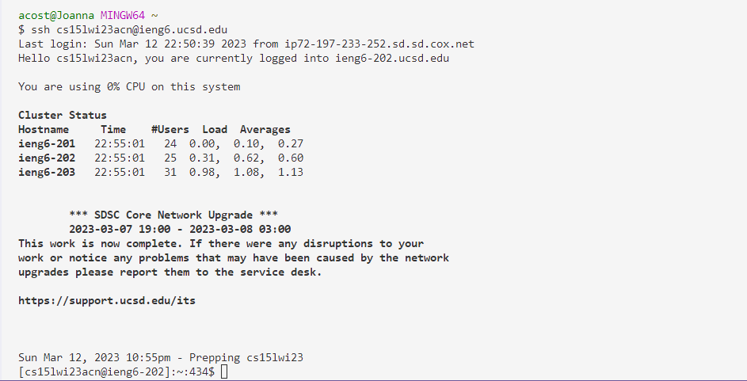
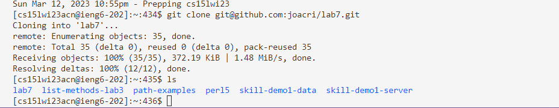
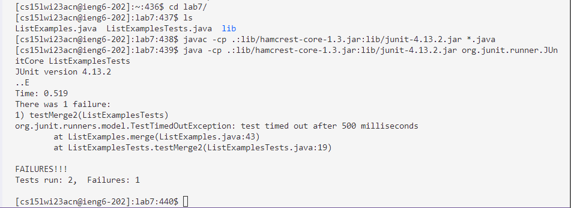
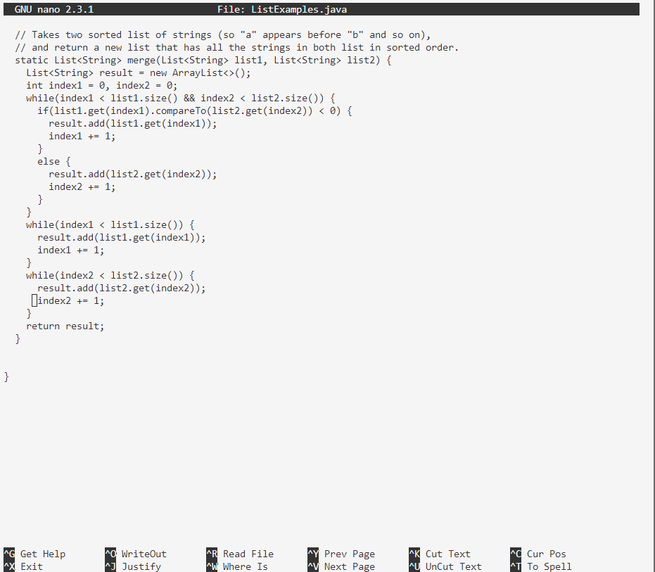
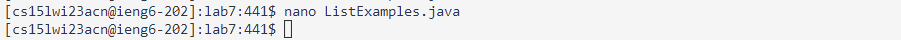
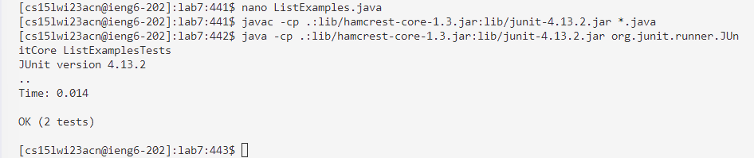
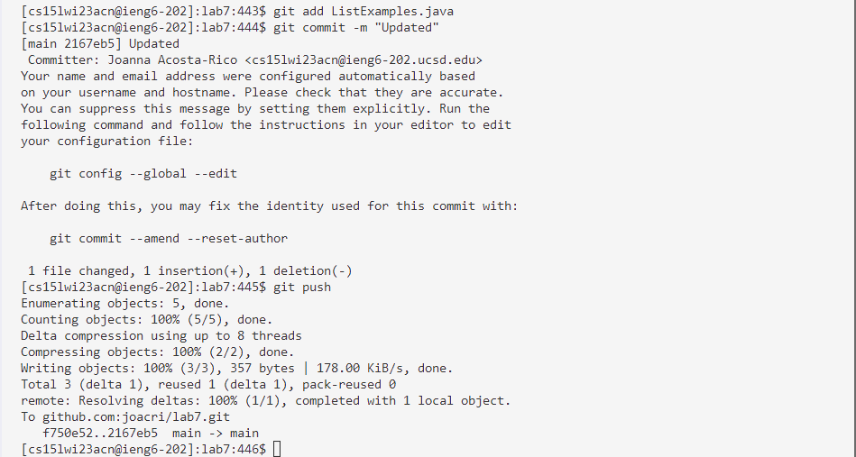

# Lab Report 4
> CLDQ

## Step 4 - Log into ieng6
`<up> <Enter>`
> The `ssh cs15lwi23acn@ieng6.ucsd.edu` command was 1 up in the search history, so I used up arrow to access it.

## Step 5 - Clone your fork of the repository from your Github account
`git clone <Ctrl + V> <Enter>`
> The ssh link `git@github.com:joacri/lab7.git` was in my clipboard from when I forked the repository, so I just used the paste shortcut to get it in my terminal.

## Step 6 - Run the tests, demonstrating that they fail
`cd L<Tab> <Enter>`
`<up> <up> <up> <up> <up> <up> <Enter>` 
`<up> <up> <up> <up> <up> <up> <Enter>`
> First I had to change directories and once I typed letter L it autocompletes to 'lab7'. Then the `javac -cp .:lib/hamcrest-core-1.3.jar:lib/junit-4.13.2.jar *.java` command was up 6 in history, so I used the up arrow to access it. The `java -cp .:lib/hamcrest-core-1.3.jar:lib/junit-4.13.2.jar org.junit.runner.JUnitCore ListExamplesTests` command was 6 up in the history, so I accessed and ran it in the same way to run the tests.

## Step 7 - Edit the code file to fix the failing test
`nano Li<Tab>.j<Tab> <Enter>` 
`<down> (42 times)` (change "index1 += 1" to "index2 += 1")
`Ctrl + O <Enter>`
`Ctrl + X`
> The nano command allows me to see the file 'ListExamples.java', which autocompletes in the command with <Tab> after typing "Li". I scroll down to line 42 where the issue was that the variable index1 was supposed to be index2 in order for the tests to pass. Ctrl + O saves the changes and Ctrl + X exits from the editor and then I will be able to type into the terminal.

## Step 8 - Run the tests, demonstrating that they now succeed
`<up> <up> <up> <Enter>`
`<up> <up> <up> <Enter>`
> The `javac -cp .:lib/hamcrest-core-1.3.jar:lib/junit-4.13.2.jar *.java` command was up 3 in history, so I used up arrow to access it. Then the `java -cp .:lib/hamcrest-core-1.3.jar:lib/junit-4.13.2.jar org.junit.runner.JUnitCore ListExamplesTests` command was 3 up in the history, so I accessed and ran it in the same way to run the tests.

## Step 9 - Commit and push the resulting change to your Github account
`git add Li <Tab>.java`
`git commit -m "Updated"`
`git push`
> I typed git add and then "Li" autocompletes to ListExamples, this command adds a change in the working directory to the staging area. Then with the git commit command it takes the staging area and stores that snapshot permanently to the Git directory. The "-m  "Updated" is to leave a message. Finally the git push uploads the local repository content to the remote repository.

