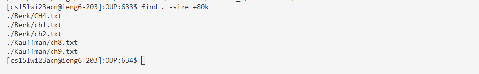
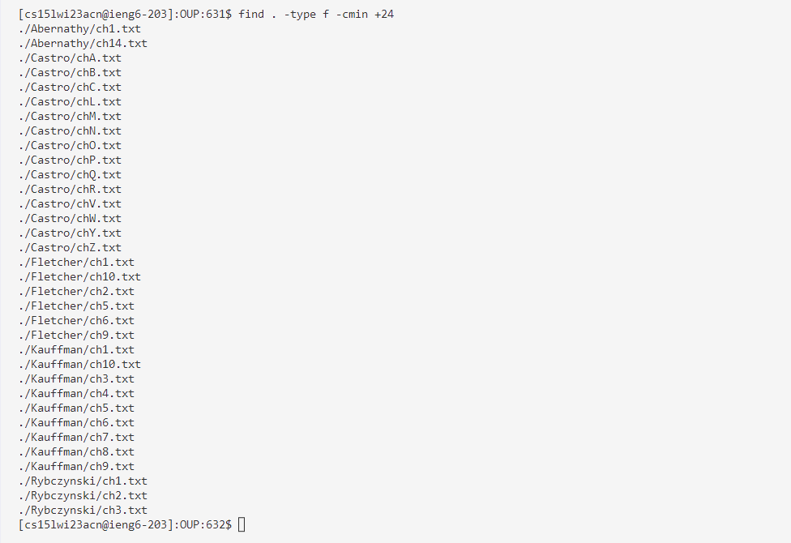
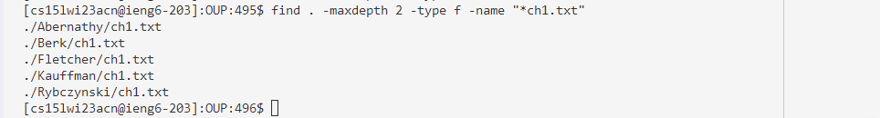
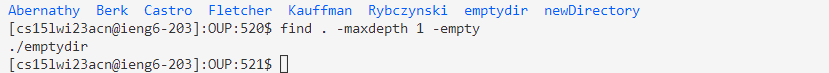
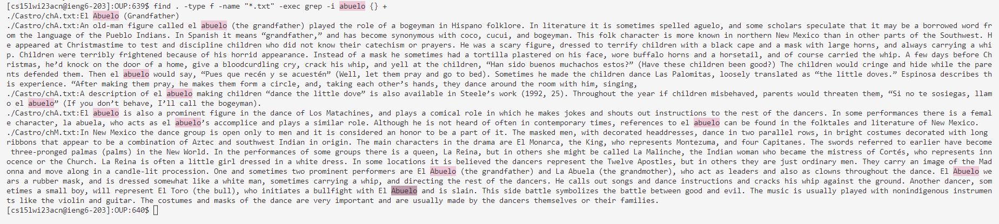
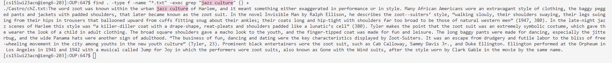

# Lab Report 5
> For this last lab report I chose to explore several options for a different command because I learned a lot of interesting things by researching commands for lab report 3.

## The command I chose to research this time is `find`
> The current working directory in which I will run the grep commands that I found is:
>
>   `/home/linux/ieng6/cs15lwi23/cs15wi23acn/docsearch/written_2/non-fiction/OUP/`
---
## 1.) `find . -size (+/-)(num)(unit) `
> Ex. 1 - Input:
```
find . -size +80k
```
> Output: 

> Explanation: This command is looking for anywhere in the file that has the string "he ", but any characters before that string can't be "t". It can be a "T", which shows an example of how this command can be useful because if you are looking for when a sentence begins with the word "The" then your options to look through are significantly narrowed down.
> 
> Source: [https://linuxhandbook.com/find-command-examples/](https://linuxhandbook.com/find-command-examples/)

> Ex. 2 - Input:
```
find . -size -2k
```
> Output: 

> Explanation: This command is looking for anywhere in the file that has the string "exico", but any characters before that string can't be "m", so in this case it is showing us all the places where Mexico is written and properly capitalized. However, this command can be useful because if you are looking for when a proper noun like Mexico isn't properly capitalized in your text. For that case you can simply edit the letter in the bracket of your command to be the capital starting letter. `grep "[^M]exico " Cancun-WhatToDo.txt`
> 
> Source: [https://linuxhandbook.com/find-command-examples/](https://linuxhandbook.com/find-command-examples/)
---
## 2.) ` find -type f -mmin (+/-) (num of minutes)`
> Ex. 3 - Input:
```
find -type f -mmin -15
```
> Output: 

> Explanation: This command looks for a string that start with the string pattern we chose, but could end with whatever, and it will highlight the number of characters, as we typed dots. In this case its helpful to find and highlight years important to Algrave's history that are mentioned in the file.
> 
> Source: [https://linuxhandbook.com/find-command-examples/](https://linuxhandbook.com/find-command-examples/)

> Ex. 4  - Input:
```
find -type f -cmin +24
```
> Output: 

> Explanation: This command looks for a string that ends with the pattern we chose, but could start with whatever, but it will highlight the number of characters, as we typed dots. In this case its helpful to find and highlight words ending in "ing" which could be activities of things to do in Barcelona.
> 
> Source: [https://linuxhandbook.com/find-command-examples/](https://linuxhandbook.com/find-command-examples/)

---
## 3.) `find . -maxdepth (num of depth)`
> Ex. 5 - Input:
```
find . -maxdepth 2 -type f -name "*ch1.txt"
```
> Output: 

> Explanation: This command is used to find and highlight places in the text where the input string is found, however, the part of the string before the ? and in the parenthesis is optional. This means that it will highlight all instances of days and Sundays. This can be useful if you are trying to find which days there are things to do, but you have a preference for Sundays.
> 
> Source: [https://linuxhandbook.com/find-command-examples/](https://linuxhandbook.com/find-command-examples/)

> Ex. 6 - Input:
```
find . -maxdepth 1 -type f -empty
```
> Output: 

> Explanation: This command is used to find and highlight places in the text where the input string is found, however, the part of the string before the ? and in the parenthesis is optional. This means that it will highlight all instances of Cty and Forbidden City. This is useful if you are trying to find specific mentions of something like cities to visit, but you want to make sure you find one in specific.
> 
> Source: [https://linuxhandbook.com/find-command-examples/](https://linuxhandbook.com/find-command-examples/)

---
## 4.) `find . -type f -name "*.txt" -exec grep "string" {} +`
> Ex. 7 - Input:
```
find . -type f -name "*.txt" -exec grep -i abuelo {} +
```
> Output: 


> Explanation: This command is specifiying that the range of characters between A-L, which are strictly uppercase letters be found in the beginning of each line in the textfile. this can be helpful if you are looking for names that begin with a letter within that range.
> 
> Source: [https://linuxhandbook.com/find-command-examples/](https://linuxhandbook.com/find-command-examples/)


> Ex. 8 - Input:
```
find . -type f -name "*.txt" -exec grep "jazz culture" {} +
```
> Output: 

> Explanation: This command is specifiying that the range of characters between M-Z, which are strictly uppercase letters be found in the text. this can be helpful if you are looking for the name of a place where you want to go that begins with a letter within that range.
> 
> Source: [https://linuxhandbook.com/find-command-examples/](https://linuxhandbook.com/find-command-examples/)
